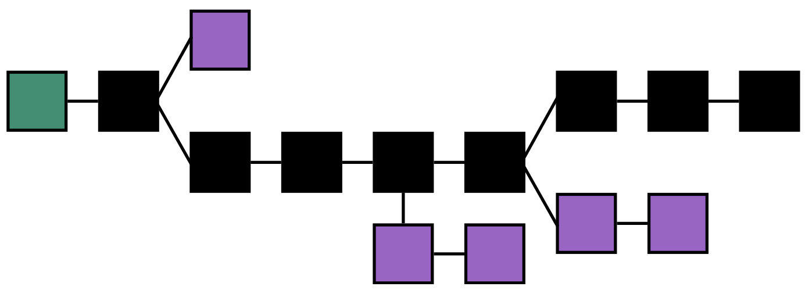
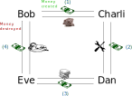
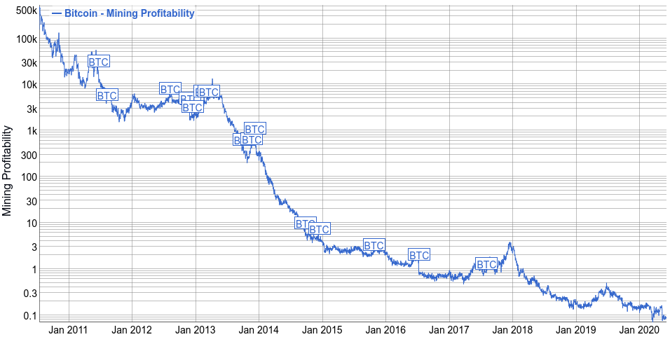
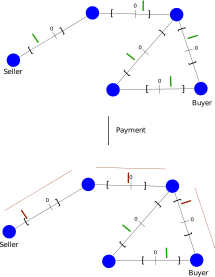
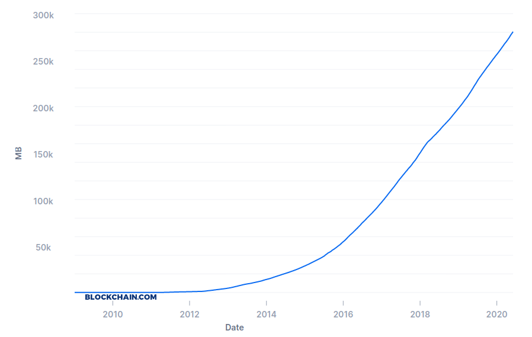
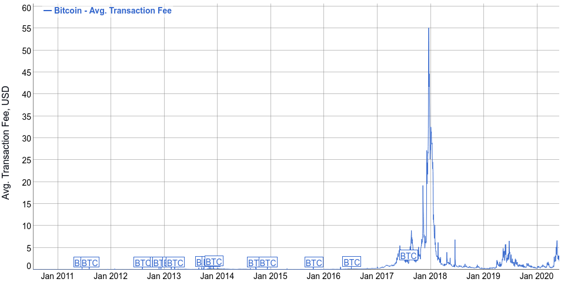

Offset is not a blockchain
==========================

The recent rise in popularity of digital currencies might make it difficult to
understand what makes Offset different in its approach to money and payments.
We present here the differences between Offset and a blockchain based digital
currency.

Summary
-------

.. list-table:: Offset - Blockchain [1]_ comparison
   :header-rows: 1

   * - 
     - Blockchain
     - Offset

   * - :ref:`global-consensus`
     - Yes
     - No

   * - :ref:`security-foundation`
     - Proof of work (Mining)
     - Trust between people

   * - :ref:`origin-of-money`
     - Created through mining
     - Created and destroyed by users. Automatically adjusts to market size.

   * - :ref:`incentives`
     - Rewards first adopters
     - Early and late adopters have the same money creation power

   * - :ref:`efficiency`
     - Transaction are very expensive
     - Transactions are cheap

   * - :ref:`transaction-speed`
     - A few minutes, up to a few hours
     - Less than a few seconds

   * - :ref:`transaction-certainty`
     - Certainty increases as time progresses, but never reaches 100%
     - 100% certainty when completed

   * - :ref:`storage`
     - Blockchain size increases at a rate of a few GBs every month
     - Small constant size (A few KBs)

   * - :ref:`fees`
     - High fees due to mining difficulty
     - Low fees

   * - :ref:`Receive payments when offline <recipient-online>`
     - Yes
     - No

.. _global-consensus:

Global consensus
----------------

Global consensus is a core idea powering blockchain based digital currencies:
All the participants in a blockchain network try to maintain together a single
view of the current state of balances for all users. Blockchain based currencies
usually use proof of work as a technology to acheive consensus: the ledger that
took the most effort to create is chosen as the global truth.

  Longest chain rule: The black chain is chosen to be the new agreed upon state, because it
  took the most effort to create. (`source <https://en.bitcoin.it/wiki/File:Blockchain.png>`__)

Contrast with blockchain currencies, Offset does not attempt to acheive global
consensus. Instead, every Offset user maintains synchronized balances with a few
selected Offset friends. In other words, each Offset user has a local view of
his own balances, and not a global view of the balances of all Offset users. **It
turns out that secure payments are possible even without a global consensus
system!**

  The figure shows how Offset keeps balances in a decentralized manner. Blue
  dots are Offset nodes, brackets represent credit limits, and green arrows
  represent the current balance between a pair of nodes. Every Offset node only
  has to maintain balace information with nodes he has direct relation to.

Offset's approach makes it much more efficient than its blockchain counterparts.
The energy footprint for every transaction is small, transactions are faster,
and the storage required for every user is of a very small constant size.

.. _security-foundation:

Security foundation
-------------------

Decentralized network can be subverted when populated by large amounts of
identities all belonging to a single malicious adversary. This kind of attack
is called a `Sybil attack <https://en.wikipedia.org/wiki/Sybil_attack>`_. We
compare here the mitigations used in blockchain systems and in Offset against
sybil attacks.

Blockchain systems use proof of work as a safeguard against Sybil attacks. This
idea can be simply described as: "one processor, one vote". **blockchain
networks rely on the fact that computation power is rare.**

Therefore an adversary has to gain meaningful computation power before he can
obtain influence over a blockchain network. In blockchain based network, having
large computation power can provide an adversary with the ability to double
spend money.

Offset does not make use of Proof of work. Instead, Offset uses trust between
people as a safeguard against Sybil attacks. In order to use Offset, a user
has to set up mutual credit lines with a few Offset friends. Friends should be
chosen carefully! Friends will usually be people the user has real world
familiarity with, or possibly a trusted local hub.

For every Offset friend, the user sets up a credit limit. The credit limit is
the maximum amount of money the friend might owe the user. It is also the
maximum amount that the user will lose in case the relationship with this
friend is lost. Hence, **Offset relies on the fact that real life relationships
are rare**. An Offset user can spend money from his mutual credit relationships
and disappear, but it will cost him relationships that might be more
valuable than the money he spent.

.. _origin-of-money:

Origin of money
---------------

Money creation in blockchains
~~~~~~~~~~~~~~~~~~~~~~~~~~~~~

Blockchain systems have a `mining
<https://en.wikipedia.org/wiki/Bitcoin#Mining>`_ mechanism for the creation of
new money. Mining is a computationaly expensive process that fills multiple
roles:

* Inserting new money (Miners are rewarded with the newly created money)
* Maintaining the blockchain consensus.

Blockchains are usually designed such that mining is initially more rewarding
to miners, and as time goes by it becomes less and less profitable. For
example, in Bitcoin, mining is designed to become `50% less profitable every
210000 blocks <https://en.bitcoin.it/wiki/Controlled_supply>`_, and the total
amount of Bitcoins ever created is limited to about 21 million.

This property of blockchains makes it more appealing for people to join early,
with the hope of becoming rich as more users join the network.

Money creation in Offset
~~~~~~~~~~~~~~~~~~~~~~~~

Money in Offset is created and destroyed by users. Offset is designed so that
the money supply changes to match the market. As the market expands, the money
supply increases. When the market shrinks, money is destroyed. Therefore, **You
will not become rich by joining Offset early**.

The total sum of balances in Offset is always zero. Consider two Offset
friends: Bob and Charli. If Bob's balance with respect to Charli is ``x``, then
Charli's balance with respect to Bob is ``-x``. The sum of those two balances
is always ``0``.

We count the amount of money in an Offset network by summing all the positive
balances. For example purposes, consider again the two Offset friends: Bob and
Charli. Suppose that initially the balance between Bob and Charli is ``0``.

Next, assume that Bob buys a chocolate bar from Charli for the price of $2. Now
the balance between Bob and Charli is -$2 from Bob's point of view, and +$2
from Charli's point of view. In the moment of purchase, new money was created
by Bob. In this case we can say that the total amount of money in the market is
$2.

The money created by Bob's purchase will be destroyed when a complete buying
cycle is complete: For example, Charli will use the newly created money to buy
something from Dan, which will use the money to buy something from Eve, which
will eventually buy services from Bob. When Eve buys from Bob, the money is
destroyed.

  The figure shows the full cycle of money creation and destruction in Offset.
  Bob created new money when he wanted to buy something but didn't have any
  money. The money created by Bob was destroyed when Eve finally used that same
  money to buy something from Bob.

.. _incentives:

Incentives
----------

Most blockchain based digital currencies reward first adopters: New money is
easier to create in the beginning. Therefore people want to join early, in
the hope of becoming rich when late users join the network.

In Bitcoin, for example, mining is designed to become `50% less profitable every
210000 blocks <https://en.bitcoin.it/wiki/Controlled_supply>`_, and the total
amount of Bitcoins ever created is limited to about 21 million.

  Bitcoin mining profitability historical chart, USD/day for 1 THash/s, shown on
  a logarithmic scale. The first adopters in 2011 could 500k US dollars per day
  with computation power of 1THash/s. Miners in 2020 can make less than half a
  dollar with the same computation power. Chart Taken from from `bitinfocharts
  <https://bitinfocharts.com/comparison/bitcoin-mining_profitability.html#log>`__.

Contrast with blockchain based currencies, **you will not become rich by joining
Offset early**. Early and late Offset users have the same money creation
power. 

The money supply in Offset matches the size of the market, and so
Offset currencies stick to their original value. Unlike blockchain based
currencies, there is no point in speculating or gambling on the future value
of Offset currencies.

Offset offers new users interest free credit, based on trust. A new user can
start using Offset by establishing Offset friendship with another Offset
user. New users do not need to spend any (traditional) money to start playing
the Offset "game".

.. _efficiency:

Efficiency
----------

Performing transactions in a blockchain based currency is very expensive.
Consider a new transaction being issued to a blockchain network. In the typical
blockchain currency, the transaction is sent to all the network participants.
Each participant has to verify the transaction. 

The network participants then have to perform expensive proof of work to
maintain consensus over the current state of the blockchain. Taking Bitcoin for
example:

  "The digital currency consumes 511 kilowatt hours of electricity for one coin
  to change hands, according to research by digiconomist. That is equivalent
  to 330,000 Visa transactions, making it the most energy-intensive form of
  electronic trading known today"
  (`source <https://www.robeco.com/en/insights/2019/04/spending-one-bitcoin-330000-credit-card-transactions.html>`__)

Finally, every participant in a blockchain network has to remember the full
blockchain (Or large part of it) in order to verify future transactions. This
means that every new transaction will have to be stored on the machines of all
the network participants forever. In Bitcoin for example, the size of the
blockchain grows by a few gigabytes every month. Those same gigabytes are stored
on all the machines running a Bitcoin client.

Offset transactions are efficient, as Offset does not rely on proof of work or
global consensus. Every Offset transaction involves communication between a few
select machines, without any significant amount of computation. The amount of
data Offset nodes has to maintain is small and constant sized.

  During an Offset payment, a few balances between a few select nodes are
  affected. The rest of the network is unaware of the transaction.

.. _transaction-speed:

Transaction speed
-----------------

In a blockchain based digital currency, every batch of transactions has to
propagate through all the participants of the blockchain network. As a means of
avoiding money `double spending
<https://en.wikipedia.org/wiki/Double-spending>`_, participants in the
blockchain network have to perform expensive `proof of work
<https://en.wikipedia.org/wiki/Proof_of_work>`_ and achieve global consensus
over the new state of the blockchain.

A blockchain transaction is considered complete only when there is enough
certainty that it will stay inside the blockchain, and this might take a long
time to happen. 

For example, in Bitcoin new blocks are added to the blockchain
at a rate of about 1 block every 10 minutes. For small transactions most users
will want to wait at least one block, and for larger transactions where stronger
certainty is required, users will sometimes prefer to even wait 6 blocks (about
one hour).

Offset transactions are very efficient with respect to their blockchain based
counterparts. This is possible because Offset does not rely on a global
consensus to operate.

It usually takes no more than a few seconds for an Offset transaction to
complete. an Offset transaction will usually pass through only a few computers
in the network that are relevant to the transaction. Offset doesn't have to
maintain any shared ledger, and therefore no consensus or proof of work are
required.

TODO: Add image demonstrating comparison between an Offset payment and a
blockchain payment, from networking point of view.

.. _transaction-certainty:

Transaction certainty
---------------------

Payments with blockchain based currencies have some amount of uncertainty. When
you send money using blockchain currencies, you have to wait for a while. The
more you wait, the more certain you are that the transaction completed
successfuly, though you will never become 100% sure.

This phenomenon is inherent to the blockchain design. When a new transaction is
added as part of a new block on the blockchain, it is still possible that a
"longer chain" not containing the new transaction will appear. A transaction is
considered to be more and more certain as new blocks are added on top of it.

.. figure:: images/how_many_bitcoin_confirmations.png
  :alt: How many bitcoin confirmations are enough?
  :height: 300px

  A diagram with thumb rules of how many bitcoin confirmations (blocks) are
  enough to be sure a transaction is complete. Taken from `buybitcoinworldwide
  <https://www.buybitcoinworldwide.com/confirmations/>`__.

Most blockchain based currencies allows the sender of money to add transaction
fees. The fees are paid to the miners that run the expensive consensus
computation (proof of work), hence miners prioritize transactions with higher
fees. Paying higher fees for a transaction makes it get into the blockchain
faster, hence increasing the certainty that it will complete successfuly in a
timely manner.

Unlike blockchain based transactions, Offset transactions do not have an element
of uncertainty. Offset transactions are 100% certain when complete. We call this
characteristic **transaction atomicity**.

An Offset transaction changes a list of balances along a path, atomically. When
the buyer hands an Offset Commitment to the seller, the transaction is complete
with 100% certainty.

.. _storage:

Storage
-------

To operate a blockchain, every network node has to store the full blockchain.
For example, the size of the bitcoin blockchain in May 2020 is more than 270GB,
and it keeps growing in the rate of about 5GB every month. 

  A chart showing historical data for Bitcoin's blockchain size. Taken from
  `blockchain.com <https://www.blockchain.com/charts/blocks-size>`__.

Offset is storage efficient. In comparison, every Offset user has to save only a
few kilobytes of information about his balances and current state, and that
amount stays constant.

.. _fees:

Fees
----

Sending money using a blockchain based currency usually requires extra
transaction fees. This is extra money paid to make sure the transaction
succeeds. Why are those fees required?

Blockchain based currencies are usually operated by miners: Those are machines
that run the computationaly expensive global consensus algorithm, Also known as proof of
work.

Running a miner is expensive, as it requires electricity, proper cooling and
other maintanence. To cover those expenses, miners are incentivized by receiving
transaction fees. In Bitcoin, for example, the average transaction fee (5/2020)
is a few US dollars. 

Miners will usually prioritize transactions with higher fees over transactions
with lower fees. Hence users that want to make sure their transaction is
processed quickly have to provide large enough fees.

If transaction fees are too low, it will become not profitable to run a miner.
Therefore blockchain based networks have a theoretical lower bound over the
transaction fees [2]_. This lower bound is related to the amount of miners in
the network, the amount of transactions (per unit of time) and to the costs of
computation.

  Historical Bitcoin average transaction fee. Note the peak at the end of 2017,
  happening due to large amount of transactions during the "Crypto boom". At that
  time the avarage transaction fee reached $55.16 per transaction. Chart Taken
  from from `bitinfocharts
  <https://bitinfocharts.com/comparison/bitcoin-transactionfees.html>`__.

Offset does not require a global consensus, and has no miners. It is extremely
cheap to run an Offset node, and so Offset fees are mostly unrelated to
computation costs. Offset fees are determined by Offset users. Every user can
decide the fees required for a certain Offset friend to transfer a transaction
through him. 

It is too early to know, though we believe that Offset fees will be mostly
related to risk management. For example, a large Offset hub might take larger
fees, because of the greater risk taken when dealing with many people, while two
family relatives might set up 0 fees, because the risk is much lower. Generally
speaking, the larger the trust between people, the lower the fees.

.. _recipient-online:

Receive payments when offline
-----------------------------

The blockchain approach allows users to collect payments even when they are
offline. For example, it is possible to send money to a Bitcoin address even if
the recipient is currently not connected to the Internet.

One downside of Offset design is that Offset users have to be online in order
to collect payments. This happens because Offset payments require the recipient
to sign using his private key. The recipient is the only one knowing his private
key, and therefore he has to be online in order to collect the incoming payment.

.. [1] 
   There are many blockchain based digital currencies, therefore the comparison
   might fail to generalize over all of them. When in doubt, the comparison
   refers to the characteristics of Bitcoin.

.. [2] Unless miners are willing to lose money
