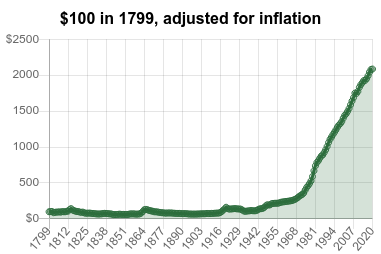
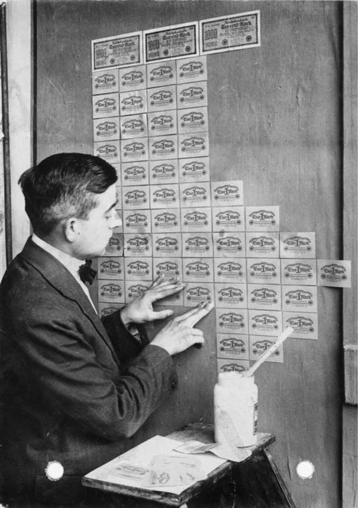

Protection from Inflation
=========================

Offset moves the power of issuing money from the state to the market
participants. Therefore, Offset credits are protected from inflation.

What is inflation?
------------------

Imagine living in 1970, having 1000 US dollars in your bank account. Now
imagine you fell asleep for 50 years, waking up in the year 2020. 

After the first moments of cultural shock, witnessing all the new roads, cars,
skyscrapers and mobile phones, at some point you will (unhappily) notice that
your 1000 US dollars you have in the bank have became much less valuable than
they used to be. An item that costs 10 US dollars in 2020 probably costed only
1.5 US dollars back in 1970!

  Changes in the price of an item that costs $100 since the year 1799. The
  price arrives at $2084.46 in the year 2020. Figure taken from
  `www.officialdata.org <https://www.officialdata.org/us/inflation/1799>`_

How can the value of the currency be measured? One way to do it is to track,
over a long period of time, how much it costs to buy an `average basket of
goods`_, and see how it changes over time. We deduce that money loses its value
over time, if the price of goods generally increases over time.

Money depreciation is not special to US dollars. People in most countries of
the world experience a similar phenomenon. Money depreciates in value as time
passes. This phenomenon is called inflation_.

Control over money supply
--------------------------

Governments in modern countries usually have control over the money supply
[1]_. This means that governments can create new money and insert it into the
market. Inflation is usually caused by the state, inserting money into the
market faster than the market produces new goods. In small doses, inflation is
considered to be a healthy enabler of long term market growth.

By handing the government the power of creating money, we trust our governments
to use this power wisely, helping create healthy economic markets.
Unfortunately, along the history, governments again and again abused their
power of controlling the money supply for short term, and sometimes corrupt
motives.

Assume for a moment that you were the king of a country, wanting to wage war
over some other country. Wars are very expensive, and you find that you do not
have enough money to fund the war. What could you do to get more money?

One way would be to ask for higher taxes from your citizens, but then the
citizens of the country could protest against the high taxes. In fact, finding
out about the high costs of the war, some citizens might prefer to not start a
war at all.

A much easier way to collect the money is to use your control over the money
supply, and just print it. You could print many new bills, and use those bills
to pay for the war [2]_. This is a stealthy way to tax all the citizens of the
country. 

At first the citizens will not notice that they were taxed. 
As the new money bills enter the market (faster than the market grows), the
prices of all the goods in the market will start rising, causing inflation. By
the time inflation hits enough time have passed. The citizens of the country
might not be able to connect between the money printing and the inflation.

  A person using bills as wallpaper during German hyperinflation in 1923, after
  the first world war.  Taken from: `rarehistoricalphotos.com
  <https://rarehistoricalphotos.com/banknotes-german-hyperinflation-1923/>`_

Except for wars, printing new money could also be used as a band aid for
overspending of the government, or for dealing with unexpected disasters.

Dangers of inflation
--------------------

High inflation rates distort the value of money and damage the ability to
trade.

Let's look at an example. Consider two merchants, Bob and Charli, living in the
same community. Bob owns a bakery, and Charli is a chocolate artist,
selling her famous chocolate bars.

Suppose that one loaf of bread at Bob's bakery costs 1USD, and one chocolate
bar at Charli's shop costs 2USD.

As part of party preparations, Bob buys 50 units of Charli's chocolate bars,
2USD each, for a total of 100USD. Charli now has extra 100USD, which she could
spend to buy anything. For example: Charli could use those 100USD to buy 100
loafs of bread from Bob's bakery. Charli keeps those extra 100USD to be used
later.

One week later, for reasons absolutely unrelated to bread and chocolate bars,
the government of Bob and Charli's country experienced economical difficulty.
This could be due to over spending of the government during the last year,
changes in the prices of oil around the world, a fast spreading epidemic or a
war with a neighboring country.

In attempt to rescue itself from the economic difficulties, the government
decides to create new money, and use it to pay its debts. As a result, new
money enters the market. Suppose for the sake of simplicity that the government
has created money worth 100% of all the previous money circulating in the
market. In other words, the amount of money circulating in the market has
doubled.

The total amount of goods in the market hasn't changed, but the amount of money
cirulating in the market has doubled. This means that every new USD has half
the value of an old USD.

TODO: Add image illustrating the changes in amounts of money.

We now go back to Bob and Charli. As the money changed its value, but the value
of one loaf of bread, or of one chocolate bar hasn't changed, Bob and Charli
decide to double the price of everything in the store. So now Bob sells one
loaf of bread for 2USD, and Charli sells one chocolate bar for 4USD.

Remember that Charli saved an extra 100USD? Before the government created new
money, Charli could use those 100USD to buy 100 loafs of bread. But now, as the
price of bread at Bob's bakery doubled from 1USD to 2USD, Charli can use the
same 100USD to buy only 50 loafs of bread! 

In the short term, the government bailed itself from debt, but Charli's
business was severely impacted.

**By creating new money, the government has distorted the value of money.** If
such events happen very often in Bob's and Charli's country, people might
conclude that holding to money is very risky. Lending money also becomes risky,
as the value of the currency might change from the time of issuing the loan to
the time of when the loan is repaid.

Protection from inflation
-------------------------

**Money created using Offset is protected from inflation.**

Distortion of value of money happens when the amount of money circulating in
the market changes disproportionally to the amount of goods produced in the
market. If the amount of money in the market doubles, and the amount of goods
in the market also doubles at the same time, the value of money should not
change. Problems arise when new money enters the market, but the amount of
goods created in the market do not change.

In traditional money systems, only the state can create money. However, the
state does not offer goods or services in return for the money created. In
other words, the state is not an active participant in the market. As a result,
new money can enter the market, without extra goods to back it up.

Offset moves the power of issuing money from the state to the market
participants. In Offset, new money is created when Charli (the chocolate
artisan) buys the cocoa powder and milk required to create chocolate bars, and
money is destroyed when Charli finally sells her chocolate bars.

Consider the example discussed in the previous section: Money printed by the
state distorts Charli's savings. Let's review this example, and see what
happens if Bob and Charli used Offset to maintain their economic relationship.

1. Bob and Charli create Offset friendship, having an initial balance of 0.
   Bob and Charli use a currency they call OUSD (Offset USD). This is a
   currency that has the value of one USD at the time the relationship between
   Bob and Charli was established. Bob sells one loaf of bread for 1 OUSD or 1
   USD, and Charli sells one chocolate bar for 2 OUSD or 2 USD.
 
2. Bob buys 50 of Charli's chocolate bars, for a total of 100 OUSD. The balance
   between Bob and Charli is now -100 OUSD. (Bob owes Charli 100 OUSD).

3. Bob's and Charli's government prints 100% more USD, which makes one USD
   twice less valuable. This means now 1 OUSD = 2 USD. Bob now sells 1 loaf
   of bread for 1 OUSD or 2 USD, and Charli sells one chocolate bar for 2 OUSD
   or 4 USD.

4. Although the value of the USD has decreased, Charli can still use her mutual
   Offset balance with Bob of +100 OUSD to buy 100 loafs of bread.

If the whole community where Bob and Charli live used Offset, they will all be
protected from the effect of inflation created by money printed by the state.

Further reading
---------------

- `The New Approach to Freedom`_ (E.C. Riegel)
- `Flight from Inflation`_ (E.C. Riegel)

.. [1] 
   The control over the money supply sometimes take other forms than the direct
   ability to print new money.

.. [2]
   When asked, you could delighfully reply that "by printing new money you make
   the country richer". 

.. _`average basket of goods`: https://en.wikipedia.org/wiki/Consumer_price_index
.. _inflation: https://en.wikipedia.org/wiki/Inflation
.. _`The New Approach to Freedom`: http://www.newapproachtofreedom.info/documents/naf.pdf
.. _`Flight from Inflation`: http://www.newapproachtofreedom.info/documents/ffi.pdf

