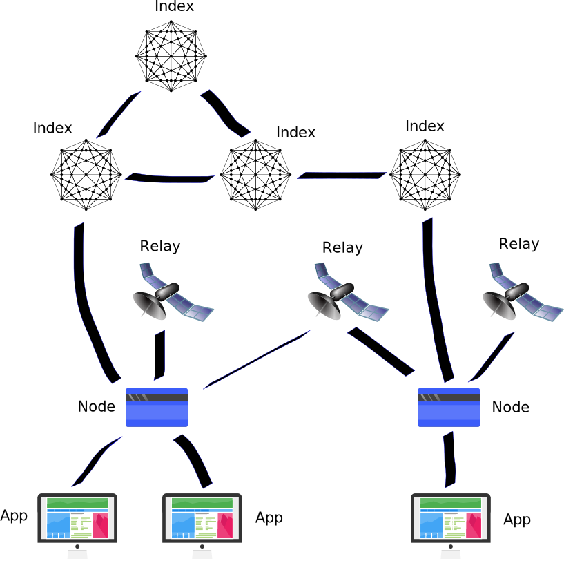

Network structure
=================

Offset's network is fully decentralized. This means that there are no
single Offset server. Instead, there are multiple instances, run by multiple
people and organizations, cooperating together to make Offset work.

**Decentralization is a core property of Offset. When control over money is
decentralized, it becomes difficult to abuse.**

For example, when you use a local Offset card inside your mobile phone, you
have full control over your card, as it is fully hosted inside your phone. No
single party can decide to confiscate your Offset credits or freeze your
Offset card.

Main network components
-----------------------

The network consists of a few entities:

-  Node (Equivalent to one Offset card)
-  Relay server (``strelay``)
-  Index server (``stindex``)
-  Application (For example: ``stctrl``)

Example network topology
------------------------

  All lines in the diagram above represent encrypted TCP connections.

Node
----

The node is the core component of the Offset network. It is roughly equivalent
to one Offset card. The node is responsible for all payment related logic.

To operate, a node needs the following information:

-  An identity file: A private key used to authenticate the identity of
   the node.
-  A database file: Used to save the current relationships (balances and
   open payment requests) with other nodes.
-  A list of trusted applications and their permissions.

Nodes of Offset friends communicate with each other. Two nodes can communicate
through a relay [1]_, using end-to-end encryption [2]_.

A node connects to relay servers to be able to accept communication from other
nodes. In addition, a node connects to index servers for two purposes:

- Reporting current credit capacities: How much credit can be pushed through a
  certain Offset friend).
- Requesting for routes. Routes of friends are required for creating Offset
  transactions.

The node listens on a TCP port for Offset applications to connect.
Applications must register ahead of time to be able to connect to the node. The
communication interface between a node and an application allows an application
to view the current node status, and perform various operations.

A node needs to be configured to have at least one relay server and one
index server to be able to operate.

Relay server
------------

In a perfect world nodes should have been able to directly communicate
with each other. However, currently many of the Internet users are not
able to receive connections directly.

As a workaround, the offset network uses relay servers. A relay server
is a server that is used as a meeting point for communication between
two nodes. A node connects to a relay server in one of two modes:

-  Wait for incoming connections from remote nodes.
-  Request to connect to a remote node.

When a node is configured to have a remote node as a friend, it must
know one or more relays on which the remote node is listening for
connections.

The relays model is decentralized. Anyone  [3]_ can run his own relay.
However, we realize that some users might not be willing (or able) to
run their own relay servers. Instead, it is possible to use the services
of a public relay.

Index server
------------

Payments in offset rely on pushing credits along a routes of nodes. We
did not manage to find a fully decentralized solution for finding
capacity routes between nodes. As a workaround, we use index servers.

A node is configured to know one or more index servers, and can ask
information about routes from the index servers. A node also sends to
the index servers periodic updates about his relationship with his
friends.

The index servers form a **Federation**. Usually every node communicates
with about one index server. The index servers then share the nodes
information with each other. This means that the information sent from a
node to one index server should eventually reach all other index servers
that are reachable from that index server.

Index servers federate with other index servers only if configured to do so.
For two index servers A and B, A and B will share information only if the two
conditions hold:

-  A trusts B
-  B trusts A

Every index server has a full picture of the whole nodes' funds network.
This allows index servers to find routes of wanted capacity efficiently,
using classical graph theoretic algorithms, like
`BFS <https://en.wikipedia.org/wiki/Breadth-first_search>`__.

Anyone can run his own index server, but to have any value, this index
server must be part of the index servers federation. On his own, an
index server will only have partial information about the nodes'
network, and therefore will not be able to find routes to any place in
the network.

Application
-----------

An Offset application connects to an Offset node, and allows viewing
information or controlling the operation of an Offset node. An application
connected to a node has the following capabilities:

-  Obtain information about the node.
-  Configure the node
-  Request routes
-  Send funds

To operate, an Application needs a private key, a target node's public key and
and address (For example: IP address). In addition, the target node must
register the Application's public key ahead of time.

An application can be any program that communicates with a node. Examples to
applications are:

- Offset mobile app.
- ``stctrl`` command line util.

The network protocol between Applications and Nodes is an open standard. You
can write your own application and connect it to your node.

.. [1]
   We use relays because in the modern Internet it is in many cases difficult
   or impossible to set up a direct connection between two user owned devices.
   Most user devices connected to the Internet, in particular mobile phones,
   are behind NATs. As a result, those devices do not own a public IP address,
   which makes it difficult to have direct communication. Maybe this could
   change in the future, and in that case, relays will not be required anymore.

.. [2]
   This means that the relay forwards the data between the two Nodes, but it
   can not read the data, because it is encrypted at the first Node and only
   decrypted at the second Node.

.. [3]
   *Almost* anyone can run a relay server. The only requirement is to have a public
   address on the Internet, for example: A public IP address, or a domain name
   (Though a certificate is not required).
